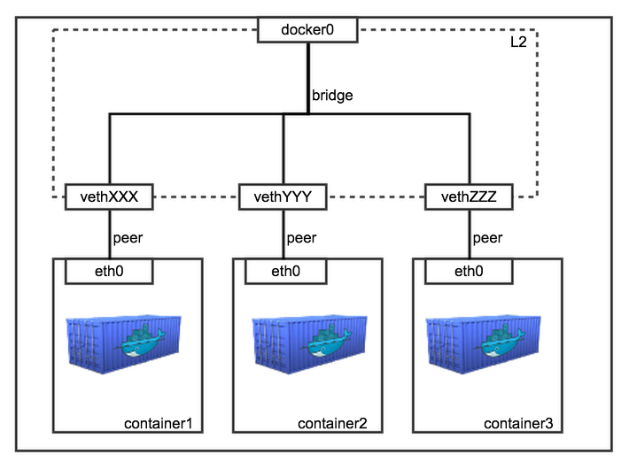

<https://bluese05.tistory.com/15>  
도커를 실행하면 네트워크 인터페이스에 docker0 이라는 브릿지 네트워크가 생기는데
이는 실제 브릿지 장비에서 볼 수 있는 브릿지 네트워크를 가상으로 추가한 것이다  
docker0 브릿지의 ip 는 ip 는 docker 에서 할당해준 가상 ip 를 사용한다(172.17.42.1)  

원래라면 이 브릿지에 다른 디바이스들이 연결되고, 해당 디바이스들 각각이 가진 네트워크 인터페이스에 의해 ip 들이 할당되야히지만  
도커의 경우 단일 노드에서 프로세스(컨테이너)를 띄우는 것이라 이에 맞춰 네트워크 인터페이스도 가상으로 생성해줘야 한다  
도커에서는 이를 위해 veth(virtual ethernet interface)를 사용한다  
이는 단순히 요청을 받아 다른 한쪽 끝으로 요청을 쏴주는, 1:1로 연결된 가상 네트워크 인터페이스이다  

도커에서 컨테이너 생성시에는  
1. veth 를 생성하고 docker0 브릿지에 할당한다(ip 는 docker0 브릿지의 네트워크 대역을 사용함)
2. 도커 컨테이너를 띄우면서 host 와 namespace 를 다르게 설정한다
3. veth 의 나머지 한쪽을 컨테이너에 할당하면서 이름을 eth0 으로 설정한다

최종적으로 아래와 같은 모습이 된다  
  

결과적으로 도커에서 생성한 컨테이너는 전부 이 docker0 브릿지에 연결되기 떄문에 도커 컨테이너끼리 통신이 가능한 것이다(가상 ip 이기 때문에 외부로는 접근 불가능)  

docker-compose 로 도커 컨테이너를 생성할 경우 docker0 과 같은 브릿지가 하나 더 연결됨  

docker0 브릿지는 노드의 실제 인터페이스인 eth0 인터페이스와 NAT 로 연결되어 있다  
그래서~ 외부에서 노드로 들어오면 docker0 으로 가고, docker0 에서 외부로 나갈땐 eth0 을 거친다  

<https://bluese05.tistory.com/38>  
container 모드를 사용하면 아예 네트워크를 공유한다(ip, mac 이 동일함)  
이건 어떤 기술을 써서 하는걸까?