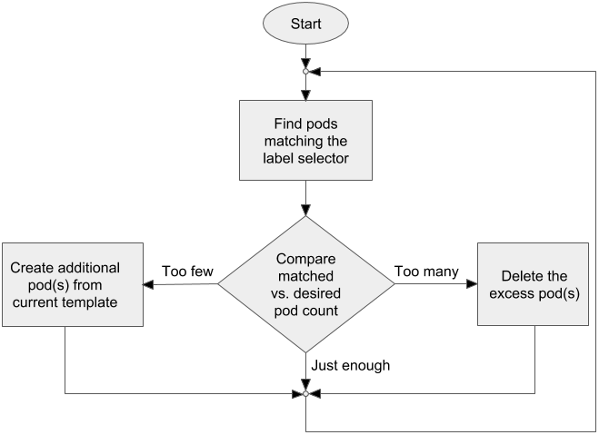
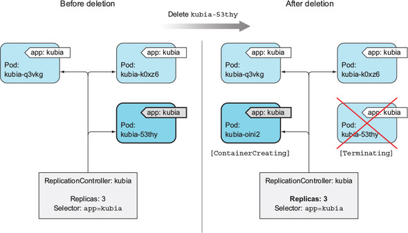
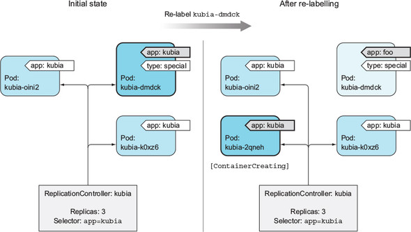
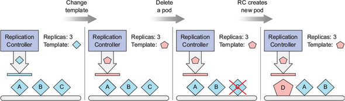

# replication controller
- 쿠버네티스 리소스의 한 종류이다
- 실행중인 pod 목록을 지속적으로 모니터링하고, **특정 유형**의 pod 수가 의도하는 pod 수와 일치하는지 항상 확인한다
    - 실행중인 pod 가 의도하는 pod 수 보다 적을 경우 pod 를 추가로 생성하고, 초과했을 경우 초과되는 pod 를 제거한다
    - 언급한 **특정 유형의 pod 들**이란 replication controller 가 label selector 로 뽑은 pod들을 말한다
- 즉 **label selector 로 뽑은 pod 들을 계속 일정한 개수만큼 유지시켜주는 리소스**라고 보면 된다
    - 

## replication controller 동작
- replication controller 에는 3가지 필수 요소가 있다
    - label selelctor : 자신이 관리할 pod 들을 결정한다
    - replica count : 유지하고자 할 pod 의 개수를 지정한다
    - pod template : 새로운 pod 를 만들 떄 사용한다

- 매니페스트 파일에서 replication controller 의 label selector 와 template 의 pod label 은 완전히 일치해야 한다
    - 그렇지 않으면 replication controller 에서 계속해서 pod 를 생성할 것이기 때문이다
    - replication controller 의 label selector 를 지정하지 않으면 template 의 pod lable 로 자동 설정한다

- 아래는 기본적인 replication controller 사용 예제이다
    ```shell
    $ kubectl get po
    NAME             READY   STATUS             RESTARTS   AGE
    kubia-k9wkn      1/1     Running            0          91s
    kubia-vr67k      1/1     Running            0          136s
    kubia-zxnwj      1/1     Running            0          142s

    $ kubectl delete po kubia-k9wkn
    pod "kubia-k9wkn" deleted

    $ kubectl get po
    NAME          READY   STATUS            RESTARTS   AGE
    kubia-866km   1/1     Terminating       0          91s
    kubia-9s9jr   0/1     ContainerCreating 0          14s
    kubia-vr67k   1/1     Running           0          139s
    kubia-zxnwj   1/1     Running           0          145s

    $ kubectl get rc
    NAME    DESIRED   CURRENT   READY   AGE
    kubia   3         3         2       2m30s
    ```
- 
- replication controller 는 삭제되는 pod 에 대해 즉시 통지를 받지만, 이 통지 자체가 pod 를 생성하는 것은 아니다
    - 이 통지를 받으면 replication controller 는 실제 pod 를 확인하고 적절한 조치를 한다

## node 장애 테스트
- 아래는 노드 장애 발생 -> 장애 복구시 진행되는 예시이다
    ```shell
    ### node 장애 발생 ###
    $ kubectl get no
    NAME                                       STATUS       ROLES    AGE    VERSION
    gke-kube-test-default-pool-dd14fbb6-6xdc   NotReady     <none>   167m   v1.14.10-gke.36
    gke-kube-test-default-pool-dd14fbb6-vmt4   Ready        <none>   147m   v1.14.10-gke.36
    gke-kube-test-default-pool-dd14fbb6-zg29   Ready        <none>   167m   v1.14.10-gke.36

    $ kubectl get po
    NAME          READY   STATUS        RESTARTS   AGE
    kubia-9s9jr   1/1     Unknown       0          91s # 기존 pod Unknown 상태
    kubia-vr67k   1/1     Running       0          139s
    kubia-zxnwj   1/1     Running       0          145s
    kubia-866km   1/1     Running       0          14s # 새로 생성됨

    ### node 복구 ###
    $ kubectl get po
    NAME          READY   STATUS        RESTARTS   AGE
    # Unknown pod 삭제
    kubia-vr67k   1/1     Running       0          139s
    kubia-zxnwj   1/1     Running       0          145s
    kubia-866km   1/1     Running       0          14s
    ```
    - 보다시피 노드에 장애가 발생 시 다른 노드에 새로운 pod 를 생성한다

## label selector 변경하기
- pod 의 label 을 변경하여 replication controller 의 범위에서 뺴거나 추가하는 것이 가능하다
    - 애초에 label selector 를 통해 pod 들을 지정했기 때문이다
- 아래는 replication controller 가 관리하던 pod 중 하나에서 label 을 제거할 경우 예시이다
    ```shell
    $ kubectl get po -L app
    NAME          READY   STATUS    RESTARTS   AGE    APP
    kubia-9s9jr   1/1     Running   0          120s   kubia
    kubia-vr67k   1/1     Running   0          163s   kubia
    kubia-zxnwj   1/1     Running   0          169s   kubia

    # label 변경
    $ kubectl lable po kubia-9s9jr app=foo --overwite
    pod 'kubia-9s9jr' labeld

    $ kubectl get po -L app
    NAME          READY   STATUS                RESTARTS   AGE    APP
    kubia-s59ar   0/1     ContainerCreating     0          3s     kubia
    kubia-9s9jr   1/1     Running               0          120s   foo   # replication controller 에 의해 더 이상 관리되지 않음
    kubia-vr67k   1/1     Running               0          163s   kubia
    kubia-zxnwj   1/1     Running               0          169s   kubia
    ```
- 
- label 조정에 따라서 아예 다른 pod 도 같은 replication controller 로 묶일 수 있다(그렇게 쓸일은 없겠지만..)
- replication controller 의 label selector 를 변경하면 replica 개수만큼 새로운 pod 가 생성된다
    - 기존 pod 는 수동 상태로 변경된다

## pod 템플릿 변경
- pod 템플릿 변경은 앞으로 생성할 pod 에만 영향을 주고, 기존 pod 에는 영향을 주지 않는다
- 

## pod 스케일링
- 단순히 replication controller 의 replicas 필드의 값만 변경해주면 된다
- kubectl scale 명령을 통해 실행할수도 있지만, kubectl edit 으로 정의를 편집해주는 것이 좀 더 낫다
- 쿠버네티스에게 무언가 하라고 알려주는 것이 아니라, 의도하는 상태를 지정할 뿐이다
    - 이 방향이 쿠버네티스의 주요 동작방식에 맞게 행동하는 것이다
    - 이 방법이 명시적으로 알려주는 방법보다 훨씬 간단하며 오류 발생 가능성이 낮다

## replication controller 삭제
- replication controller 를 삭제하면 해당 rc 가 관리하는 pod 들도 모두 삭제된다
- cascade 옵션을 줘서 replication controller 만 삭제하고, pod 들은 삭제하지 않게 할 수 있다
    ```shell
    $ kubectl delete rc kubia --cascade=false
    ```
- replication controller 를 replicaset 으로 바꾸고자 할 떄, cascade=false 옵션을 사용하면 중단없이 진행할 수 있다


---

# replica set
- 차세대 replication controller 이며, 추후에는 모든 replication controller 를 대체할 리소스이다
- replication controller 와 똑같이 동작하지만 좀 더 풍부한 표현식을 사용하는 pod selector 를 가지고 있다

- replicaset 의 주요 속성은 아래와 같다
    - selector.matchLabels
        - label 을 equals 비교한다(replication controller 와 동일)
        - label 을 여러개 줄 수 있다(replication controller 와 다름)        
    - selector.matchExpressions
        - 표현식을 추가할 수 있다
        - key, operator, values 필드를 작성해줘야 한다
        - operator 에 사용가능한 연산자는 아래와 같다
            - In : label 의 값이 지정된 값 중 하나와 일치해야 한다
            - NotIn : label 의 값이 지정된 값과 일치하지 않아야 한다
            - Exists : 지정된 키를 가진 label 이 포함되어야 한다(values 필드를 지정하지 않아야한다)
            - DoesNotExists : 지정된 키를 가진 label 이 포함되지 않아야한다(values 필드를 지정하지 않아야한다)