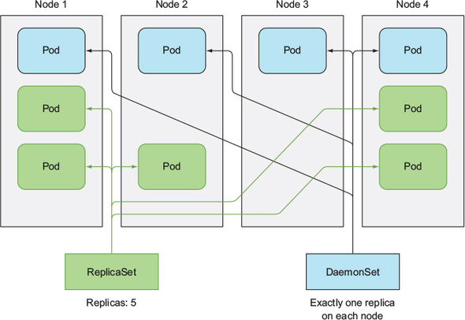

# daemon set
- 클러스터내의 모든 노드에, 노드당 하나의 파드만 실행되길 원하는 경우 사용한다
    - 시스템 수준의 작업을 수행하는 인프라 관련 파드가 이런 경우이다
    - e.g. 로그 수집기, 리소스 모니터링, kube-proxy
- 
    - daemon set 은 각 노드에 하나의 파드를 실행하지만 replica set 은 클러스터 전체에 무작위로 pod 를 분산시킨다
- 노드가 삭제되어도 다른곳에 pod 를 생성하지 않지만, 노드가 추가되면 해당 노드에 새 pod 를 생성한다
    - replication 과 마찬가지로 template 으로 pod 를 생성한다
- 아래는 node 에 label 을 추가하고 뺄 때 pod 가 저장하고 삭제되는 예시이다
    ```shell
    $ kubectl get no
    NAME                                       STATUS   ROLES    AGE   VERSION
    gke-kube-test-default-pool-dd14fbb6-1fg4   Ready    <none>   36m   v1.14.10-gke.36
    gke-kube-test-default-pool-dd14fbb6-52kn   Ready    <none>   36m   v1.14.10-gke.36
    gke-kube-test-default-pool-dd14fbb6-frz7   Ready    <none>   36m   v1.14.10-gke.3

    $ kubectl get po
    No resources found in default namespace.

    # label 추가
    $ kubectl label no gke-kube-test-default-pool-dd14fbb6-1fg4 disk=ssd
    node/gke-kube-test-default-pool-dd14fbb6-1fg4 labeled

    $ kubectl get po -o wide
    NAME                READY   STATUS              RESTARTS   AGE     IP          NODE       NOMINATED NODE   READINESS GATES
    ssd-monitor-62rnx   0/1     ContainerCreating   0          3m30s   10.56.1.7   ...-1fg4   <none>           <none>

    # label 변경
    $ kubectl label no gke-kube-test-default-pool-dd14fbb6-1fg4 disk=hdd --overwrite
    node/gke-kube-test-default-pool-dd14fbb6-1fg4 labeled

    $ kubectl get po -o wide
    NAME                READY   STATUS        RESTARTS   AGE     IP          NODE       NOMINATED NODE   READINESS GATES
    ssd-monitor-62rnx   1/1     Terminating   0          3m30s   10.56.1.7   ...-1fg4   <none>           <none>
    ```