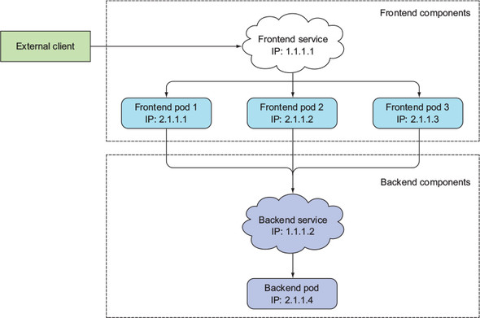

# service
- 대다수의 어플리케이션은 외부 요청에 응답하기 위한 것이다
- 하지만 pod 는 여기저기서 생성되고 제거될 수 있는 일시적인 존재라 매번 ip 가 달라지므로, 외부에서 일관된 방법으로 pod 에 접근할 수 없다
- 여러개의 pod 들을 단일 IP 주소로 액세스 할 방법이 필요하다
- 이를 위해 나온 것이 `서비스` 이다
- 아래는 서비스가 하는 역할을 도식화 한 그림이다
    - 
    - 보다시피 외부에서는 단일 엔드포인트로 접속하고, 요청은 내부의 pod 들에게 로드밸런싱 된다

### service 생성
- [kubia-svc.yaml](kubia-svc.yaml) 파일 참조
- label selector 를 사용하는 메커니즘이 service 에도 그대로 적용된다
- 포트 포워딩이 가능하며, 멀티포트 지정 또한 가능하다
    - 포트마다 label selector 를 다르게 할 순 없다
- 생성된 서비스는 보다시피 내부 ip(CLUSTER-IP) 만 존재하는 상태이다
    ```shell
    $ kubectl create -f kubia-svc.yaml
    service/kubia created

    $ kubectl get svc
    NAME         TYPE        CLUSTER-IP    EXTERNAL-IP   PORT(S)          AGE
    kubernetes   ClusterIP   10.120.0.1    <none>        443/TCP          7d1h
    kubia        ClusterIP   10.120.9.43   <none>        80/TCP,443/TCP   49s
    ```
- 내부 pod 에서 서비스 ip로 통신이 가능하다
    ```shell
    $ kubectl get po
    NAME          READY   STATUS    RESTARTS   AGE
    kubia-24brm   1/1     Running   0          56s
    kubia-v4hnm   1/1     Running   0          56s
    kubia-zcmpd   1/1     Running   0          56s

    # -- 이후로는 pod 에 전달되는 명령어이다
    $ kubectl exec kubia-24brm -- curl -s 10.120.9.43
    You've hit kubia-zcmpd

    $ kubectl exec kubia-24brm -- curl -s 10.120.9.43
    You've hit kubia-24brm
    
    $ kubectl exec kubia-24brm -- curl -s 10.120.9.43
    You've hit kubia-v4hnm
    ```
    - 보다시피 요청이 매번 다른 pod 로 로드밸런싱 되고 있다

### service 검색
클라이언트 pod 는 2가지 방법으로 서비스의 IP 를 알아내고 통신할 수 있다
- 환경변수를 통한 서비스 검색
    - pod 는 시작되는 시점에 존재하는 서비스들의 IP 를 환경변수에 초기화한다
        ```shell
        $ kubectl get svc
        NAME         TYPE        CLUSTER-IP    EXTERNAL-IP   PORT(S)          AGE
        kubernetes   ClusterIP   10.120.0.1    <none>        443/TCP          7d1h
        kubia        ClusterIP   10.120.9.43   <none>        80/TCP,443/TCP   49s

        # kubia-24brm pod 생성

        $ kubectl exec kubia-24brm env
        ...
        KUBIA_SERVICE_HOST=10.120.9.43
        KUBIA_SERVICE_PORT_HTTP=80
        KUBIA_SERVICE_PORT_HTTPS=443
        ...
        ```
    - service 의 ip 와, 지정했던 port 들을 볼 수 있다
    - pod 에서는 위의 환경변수 이름으로 service 의 ip 를 얻고 통신이 가능하다
        - 네이밍 룰은 보다시피 `{service-name}_SERVICE_{property}` 의 형태이다
    - pod 가 뜰 떄 초기화한다는 특징 떄문에, service 가 항상 pod 보다 먼저 떠야한다
        - 아니면 새로 pod 를 시작해줘야 한다
- DNS 를 통한 서비스 검색
    - 쿠버네티스 master 노드(kube-system 네임스페이스)에는 `kube-dns` 라는 service 가 있다
        - 여러개의 kube-dns pod 들이 있고, 이를 가리키는 kube-dns service 가 있다
    - 이는 dns 서버로써, 쿠버네티스에서 실행중인 모든 서비스를 알고 있다
    - 그리고 모든 pod 들은 이 dns 서버를 사용한다
        - pod 내 `/etc/resolv.conf` 를 보면 kube-dns service 의 ip 가 지정되어 있음을 볼 수 있다
    - 이와 같은 이유로 모든 pod 들은 별다른 설정없이 service 이름만으로 service 와 통신할 수 있다
        ```shell
        $ kubectl exec kubia-24brm -- curl -s kubia
        You've hit kubia-zcmpd
        ```
        - service 의 실제 FQDN 은 `{service-name}.{namespace-name}.svc.cluster.local` 이지만, 같은 네임스페이스에 있을 경우 service-name 아래는 모두 생략이 가능하다

### service 네트워크
이쯤에서 service 가 어떤식으로 동작하는지 알고가면 좋다  
참고 : <https://arisu1000.tistory.com/27851?category=787056>  

요약하자면,  
- service 의 cluster ip 는 어떠한 네트워크 인터페이스에도 할당되어 있지 않다
- pod 에서 cluster ip 로 요청을 했을 때, **cbr0 <-> eth0 사이에 존재하는 NAT 에서 이 cluster IP 를 pod 의 IP 로 변환해준다**
    1. iptables 를 통해 service 의 ip 를 pod 의 ip 로 변환해준다
        - iptables 의 DNAT를 이용해 pod 들 사이에 로드밸런싱을 수행한다
    2. pod 의 ip 를 dest 로 설정하고 게이트웨이로 간다
        - 여기서 변환된 pod 의 ip 의 네트워크 대역이 노드의 cbr0 브릿지 네트워크 대역과 같더라도, 게이트웨이로 가는 행위를 막을 수 없다
        - iptables 에 로직을 넣을 수는 없기 때문이다
        - 즉.. 동일한 node 에 있는 pod 라도 게이트웨이를 거쳤다가 와야한다
    3. 게이트웨이에서 pod 의 ip 가 있는 노드를 찾는다
    4. 해당 노드에서 해당 pod 를 찾는다
- 즉, service 의 cluster ip 는 실제 할당된 IP 가 아니라 단순 매핑용 IP 일 뿐이다
- 과거에는 kube-proxy 가 직접 해줬으나, 성능 이슈 때문에 iptables 로 변경하였다(kube-proxy 는 apiserver 로 부터 요청을 받아 iptables 를 수시로 변경)
    - iptables 에 규칙이 수천개가 되면 결국 또 성능 이슈가 발생하기 떄문에, 최근에는 ipvs 를 이용해 구현하는 기능이 나왔다

### endpoint
- service 와 pod 는 직접 연결되는 것이 아니라, 중간에 endpoint 라는 리소스가 끼어있다
    ```shell
    $ kubectl get ep
    NAME         ENDPOINTS                                          AGE
    kubernetes   34.64.180.77:443                                   7d2h
    kubia        10.56.2.11:8080,10.56.2.12:8080,10.56.2.13:8080    52m
    ```
    - pod 의 ip 주소와 포트들이 연결된 것을 확인할 수 있다
    - DNAT 에 추가할 ip 목록이라고 보면 될 듯..
- 실제 service 의 pod selector 는 들어오는 요청을 전달할 떄 직접 사용하지 않고, 위의 endpoint 를 생성할 때 사용된다
    - 그리고 들어오는 요청을 endpoint 에 있는 ip + port 목록 중 하나로 전달하는 것이다
- endpoint 는 service 생성 시 label selector 를 명시하면 자동으로 생성된다(지정하지 않으면 생성되지 않음)
- endpoint 를 수동으로 생성하여 service 와 외부 서버를 연결시킬 수 있다
    - [external-svc-without-endpoints.yaml](external-svc-without-endpoints.yaml), [external-svc-endpoints.yaml](external-svc-endpoints.yaml) 파일 참조
    - 이처럼 구성하면 외부 서버들에 대해 일반 service 를 이용하는 것 처럼 이용할 수 있다
    - 나중에 쿠버네티스 내 pod 들로 마이그레이션 하기도 수월하다

### ExternalName service
- 외부 서버를 service 에 연결하기 위해 위의 방법보단, `ExternalName` service 를 이용하는 것이 더 간단하다
    - [external-svc-externalname.yaml](external-svc-externalname.yaml) 참조
- ExternalName service 는 위의 endpoints 를 생성하는 방식이 아닌, DNS 레벨에서 CNAME 만 추가해주는 방식으로 동작한다
    - iptables 를 갈 필요가 없기 떄문에 cluster ip 가 필요없다
    - iptables 에 도메인은 입력 못하기 떄문에 ExternalName 형태가 아닌 service 들은 cluster ip 가 필요하다


## 외부 클라이언트에 service 노출
지금까지 생성한 service 는 내부에서만 접근이 가능했는데, 외부에서도 접근이 가능하게 하려면 service 를 다른 타입으로 생성해야 한다(default : ClusterIP)  

### NodePort 타입으로 service 생성
- [kubia-svc-nodeport](kubia-svc-nodeport.yaml) 참조
- 노드 IP + 할당된 노드의 port 로 service 에 엑세스 할 수 있다
- NAT 에서 service ip 를 pod 의 ip 로 변경해줬던 것 처럼, port 로 들어오는 요청을 pod 의 ip 로 바꿔서 cbr0 브릿지로 전달한다(DNAT)
- 변경된 pod 의 ip 를 cbr0 브릿지 내에서 찾을 수 없다면, 다시 eth0 을 타고 게이트웨이로 가서 해당 pod 를 찾게 된다
    - 이런 네트워크 홉을 막고 싶다면 아래와 같이 설정하면 된다
        ```yaml
        spec:
            externalTrafficPolicy: Local # default : Cluster
        ```
    - 이러면 bridge 에서 pod 를 찾지 못할 경우 게이트웨이로 가는 행위를 하지 않게 되는데, port 에 대한 pod ip 대상을 자신의 노드안에 있는 pod 만 대상으로 지정하게끔 해주는 것 같다
    - 이렇게 설정하면 요청이 모든 pod 에게 균등하게 분산되는 특징을 적용할 수 없게 된다
- 특정 노드만 해당하는 것이 아니라, 어떤 워커 노드든 지정한 port 로 service 에 접근할 수 있다
    - cluster ip 로도 여전히 참조 가능하다
- 이 상태 그대로는 사용할 수 없고, 앞에 로드밸런서를 따로 붙여줘야 한다(요청 분산 + 장애난 노드에는 접근하지 않음)
    - 물론 노드 ip 로도 외부에서 접근할수는 있으나 상용에 사용할수는 없다

### LoadBalancer 타입으로 service 생성
- [kubia-svc-loadbalancer](kubia-svc-loadbalancer.yaml) 참조
- 클라우드 서비스를 사용하고 있다면 로드밸런서를 자동으로 생성시키고 붙여줄 수 있다
- 타입을 LoadBalancer 타입으로만 설정해주면 된다
- 단순히 LoadBalancer 가 있는 NodePort 타입이라고 생각하면 된다
    - 기존의 NodePort 방식으로도 service 에 접근할 수 있다

### Ingress 생성
- ingress 를 사용하면 한 ip 주소로 수십개의 서비스에 접근이 가능하도록 설정할 수 있다
    - HTTP 요청을 ingress 에 보낼 때, 요청한 호스트와 경로에 따라 서비스가 결정된다
- ingress 를 생성하기 전에, 생성할 클러스터에 ingress controller 가 실행해야 한다
    - 이를 지원하지 않는 클러스터도 있다
- ingress 에 지정한 hostname 과 ip 를 맞춘 뒤, 해당 hostname 으로 요청을 보낸다
- ingress controller 는 전달받은 요청의 헤더를 보고(hostname, context) 일치하는 service 를 찾고, 요청을 그쪽으로 보낸다

- 동일한 호스트의 다른 경로에 여러 서비스를 매핑할 수 있다
    ```yaml
    ...
    - host: kubia.example.com
      http:
        paths:
        - path: /foo
          backend:
            serviceName: foo
            servicePort: 80
        - path: /bar
          backend:
            serviceName: bar
            servicePort: 80
    ```
- 다른 호스트에 다른 서비스를 매핑할 수도 있다
    ```yaml
    rules:
    - host: foo.example.com
        http:
        paths:
        - path: /
          backend:
            serviceName: foo
            servicePort: 80
    - host: bar.example.com
        http:
        paths:
        - path: /
          backend:
            serviceName: bar
            servicePort: 80
    ```
    - foo.example.com 과 bar.example.com 은 모두 ingress 의 ip 주소로 지정해야 한다


## readiness probe
- pod 가 클라이언트 요청을 수신할 수 있는지 체크하고, 성공을 반환하면 service 를 통해 요청을 수신하도록 한다
    - readiness probe 가 성공하면 endpoints 에 넣고, 실패하면 endpoints 에서 제거한다
- liveness probe 와는 달리, probe 가 실패하더라도 컨테이너가 종료되거나 다시 시작되지 않는다
    - service 를 통해 요청을 수신할 것인지 수신하지 않을 것인지만 결정한다
- readiness probe 가 있음으로써 정상 상태인 pod 하고만 통신하게끔 할 수 있다
- liveness probe 와 동일하게 probe 방식은 HTTP GET, TCP 소켓, exec 의 3가지 방법이 있다
- liveness probe 와 동일하게 지정한 주기마다 계속해서 실행된다
    - probe 가 실패하면 READY status 가 0/1 의 형태로 표시된다
    - 위에서도 언급했지만, pod 를 재시작 하지는 않는다
- readiness probe 를 추가하지 않으면 pod 가 생성되는 즉시 endpoints 에 추가되므로, pod 가 뜨는 시간등을 고려해서 **readiness probe 를 필수로 작성해야 한다**

## headless service
- service 의 ClusterIP 속성을 None 으로 지정하면 cluster ip 가 지정되지 않는다
- 이 상태에서 dns 에 service name 을 질의하면, 여러개의 pod ip 목록이 반환된다
- 이 처럼 service 에 cluster ip 가 할당되지 않은 상태를 headless 상태라고 한다
- 아래는 headless service 의 hostname 으로 dns query 했을 때 나오는 A 레코드 들이다
    ```shell
    $ kubectl exec dnsutils -- nslookup kubia-headless
    Server:		10.120.0.10
    Address:	10.120.0.10#53

    Name:	kubia-headless.default.svc.cluster.local
    Address: 10.56.2.18
    Name:	kubia-headless.default.svc.cluster.local
    Address: 10.56.2.19
    Name:	kubia-headless.default.svc.cluster.local
    Address: 10.56.2.20
    ```
    - 이 3개의 pod 들은 DNS 라운드로빈 메커니즘으로 로드밸런싱이 제공된다

---

ingress controller = nginx, ingress 의 정보들을 가져와서 사용함
service 는 특정  서버가 아니라 하나의 명세 같은 것이다
headless 서비스
