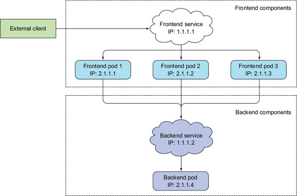

# service
- 대다수의 어플리케이션은 외부 요청에 응답하기 위한 것이다
- 하지만 pod 는 여기저기서 생성되고 제거될 수 있는 일시적인 존재라 매번 ip 가 달라지므로, 외부에서 일관된 방법으로 pod 에 접근할 수 없다
- 여러개의 pod 들을 단일 IP 주소로 액세스 할 방법이 필요하다
- 이를 위해 나온 것이 `서비스` 이다
- 아래는 서비스가 하는 역할을 도식화 한 그림이다
    - 
    - 보다시피 외부에서는 단일 엔드포인트로 접속하고, 요청은 내부의 pod 들에게 로드밸런싱 된다

## service 생성
- [kubia-svc.yaml](kubia-svc.yaml) 파일 참조
- label selector 를 사용하는 메커니즘이 service 에도 그대로 적용된다
- 포트 포워딩이 가능하며, 멀티포트 지정 또한 가능하다
    - 포트마다 label selector 를 다르게 할 순 없다
- 생성된 서비스는 보다시피 내부 ip(CLUSTER-IP) 만 존재하는 상태이다
    ```shell
    $ kubectl create -f kubia-svc.yaml
    service/kubia created

    $ kubectl get svc
    NAME         TYPE        CLUSTER-IP    EXTERNAL-IP   PORT(S)          AGE
    kubernetes   ClusterIP   10.120.0.1    <none>        443/TCP          7d1h
    kubia        ClusterIP   10.120.9.43   <none>        80/TCP,443/TCP   49s
    ```
- 내부 pod 에서 서비스 ip로 통신이 가능하다
    ```shell
    $ kubectl get po
    NAME          READY   STATUS    RESTARTS   AGE
    kubia-24brm   1/1     Running   0          56s
    kubia-v4hnm   1/1     Running   0          56s
    kubia-zcmpd   1/1     Running   0          56s

    # -- 이후로는 pod 에 전달되는 명령어이다
    $ kubectl exec kubia-24brm -- curl -s 10.120.9.43
    You've hit kubia-zcmpd

    $ kubectl exec kubia-24brm -- curl -s 10.120.9.43
    You've hit kubia-24brm
    
    $ kubectl exec kubia-24brm -- curl -s 10.120.9.43
    You've hit kubia-v4hnm
    ```
    - 보다시피 요청이 매번 다른 pod 로 로드밸런싱 되고 있다

### service 검색
클라이언트 pod 는 2가지 방법으로 서비스의 IP 를 알아내고 통신할 수 있다
- 환경변수를 통한 서비스 검색
    - pod 는 시작되는 시점에 존재하는 서비스들의 IP 를 환경변수에 초기화한다
        ```shell
        $ kubectl get svc
        NAME         TYPE        CLUSTER-IP    EXTERNAL-IP   PORT(S)          AGE
        kubernetes   ClusterIP   10.120.0.1    <none>        443/TCP          7d1h
        kubia        ClusterIP   10.120.9.43   <none>        80/TCP,443/TCP   49s

        # kubia-24brm pod 생성

        $ kubectl exec kubia-24brm env
        ...
        KUBIA_SERVICE_HOST=10.120.9.43
        KUBIA_SERVICE_PORT_HTTP=80
        KUBIA_SERVICE_PORT_HTTPS=443
        ...
        ```
    - service 의 ip 와, 지정했던 port 들을 볼 수 있다
    - pod 에서는 위의 환경변수 이름으로 service 의 ip 를 얻고 통신이 가능하다
        - 네이밍 룰은 보다시피 `{service-name}_SERVICE_{property}` 의 형태이다
- DNS 를 통한 서비스 검색
    - 쿠버네티스 master 노드(kube-system 네임스페이스)에는 `kube-dns` 라는 service 가 있다
        - 여러개의 kube-dns pod 들이 있고, 이를 가리키는 kube-dns service 가 있다
    - 이는 dns 서버로써, 쿠버네티스에서 실행중인 모든 서비스를 알고 있다
    - 그리고 모든 pod 들은 이 dns 서버를 사용한다
        - pod 내 `/etc/resolv.conf` 를 보면 kube-dns service 의 ip 가 지정되어 있음을 볼 수 있다
    - 이와 같은 이유로 모든 pod 들은 별다른 설정없이 service 이름만으로 service 와 통신할 수 있다
        ```shell
        $ kubectl exec kubia-24brm -- curl -s kubia
        You've hit kubia-zcmpd
        ```
        - service 의 실제 FQDN 은 `{service-name}.{namespace-name}.svc.cluster.local` 이지만, 같은 네임스페이스에 있을 경우 service-name 아래는 모두 생략이 가능하다

## endpoint
- service 와 pod 는 직접 연결되는 것이 아니라, 중간에 endpoint 라는 리소스가 끼어있다
    ```shell
    $ kubectl get ep
    NAME         ENDPOINTS                                          AGE
    kubernetes   34.64.180.77:443                                   7d2h
    kubia        10.56.2.11:8080,10.56.2.12:8080,10.56.2.13:8080    52m
    ```
    - pod 의 ip 주소와 포트들이 연결된 것을 확인할 수 있다
- 실제 service 의 pod selector 는 들어오는 요청을 전달할 떄 직접 사용하지 않고, 위의 endpoint 를 생성할 때 사용된다
    - 그리고 들어오는 요청을 endpoint 에 있는 ip + port 목록 중 하나로 전달하는 것이다
- endpoint 는 service 생성 시 label selector 를 명시하면 자동으로 생성된다(지정하지 않으면 생성되지 않음)
- endpoint 를 수동으로 생성하여 service 와 외부 서버를 연결시킬 수 있다
    - [external-service.yaml](external-service.yaml), [external-service-endpoints.yaml](external-service-endpoints.yaml) 파일 참조
    - 이처럼 구성하면 외부 서버들에 대해 일반 service 를 이용하는 것 처럼 이용할 수 있다
    - 나중에 쿠버네티스 내 pod 들로 마이그레이션 하기도 수월하다

### ExternalName service
- 외부 서버를 service 에 연결하기 위해 위의 방법보단, `ExternalName` service 를 이용하는 것이 더 간단하다
    - [external-service-externalname.yaml](external-service-externalname.yaml) 참조
- ExternalName service 는 위의 endpoints 를 생성하는 방식이 아닌, DNS 레벨에서 CNAME 만 추가해주는 방식으로 동작한다
    - 이러한 이유로 ExternalName type 의 service 는 CLUSTER-IP 를 얻지 못한다
    - 일반 service 의 CLUSTER-IP 는 어떤 리소스의 ip 일까? endpoints?