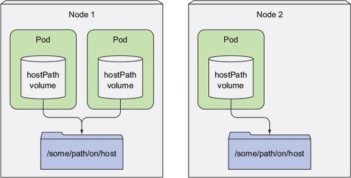
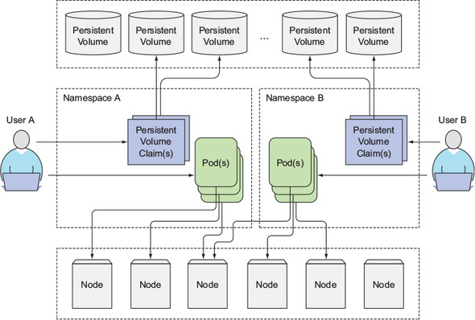

# volume
- pod 내 컨테이너들끼리 CPU, RAM, NIC 등은 공유하지만 디스크는 공유하지 못한다
    - 파일 시스템은 컨테이너 이미지에서 제공되기 때문이다
    - 이 같은 특징 때문에, 새로 시작한 컨테이너는 이전에 실행했던 컨테이너에 쓰여진 파일시스템의 어떤것도 볼 수 없다(같은 pod 내에서 실행되었더라도 마찬가지)
- 위와 같은 요구사항은 언제든 발생할 수 있는데, 쿠버네티스는 이를 volume 이라는 개념을 통해 해결한다

- 예를 들어 한 pod 에 아래와 같은 3개의 컨테이너가 들어있다고 가정해보자
    - /var/htdocs 에 있는 html 페이지를 서비스하고, /var/logs 에 로그를 쌓는 웹 서버 컨테이너
    - /var/html 에 주기적으로 html 파일을 생성해서 넣는 컨테이너
    - /var/logs 에 있는 로그를 처리하는 컨테이너
- 컨테이너 3개가 같이 동작해야하며, 같은 파일 시스템을 공유해야 한다
- 
    - publicHtml, logVol 이라는 volume 을 2개 만들고, 각 컨테이너에서 원하는 파일시스템의 경로에 volume 을 마운트했다
- 보다시피 volume 은 2가지 특성이 있다
    - 쿠버네티스 리소스가 아니므로 자체적으로 생성, 삭제될 수 없다
    - volume 을 생성만 한다고 되는것이 아니라, 각 컨테이너에서 직접 마운트 해줘야 한다

- volume 에도 여러 종류의 타입들이 있다
    - 위에서 사용한 volume 의 타입은 `emptyDir` 이다


## volume 을 사용한 컨테이너 간 데이터 공유
### emptyDir
- [fortuneloop.sh](fortuneloop.sh), [Dockerfile](Dockerfile), [fortune-pod.yaml](fortune-pod.yaml) 참조
- volume 이 빈 디렉터리로 시작된다
- 어떤 파일이든 volume 에 쓸 수 있다
- volume 의 라이프사이클이 pod 에 묶여 있으므로, pod 가 삭제되면 volume 의 컨텐츠도 삭제된다
- pod 를 호스팅하는 워커 노드의 실제 디스크에 생성된다 
    - 노드 디스크의 유형에 따라 성능이 결정된다
    - **여러 pod 간 volume 의 데이터를 공유할 수 없다**

### gitRepo
- [gitrepo-volume-pod.yaml](gitrepo-volume-pod.yaml) 참조
- 이름 그대로 git repository 에서 특정 리비전을 체크아웃해서 데이터를 채운다
- emptyDir volume 을 생성한 뒤 데이터를 채우는 것이다(emptyDir 의 확장)
- git 리포지터리와 동기화되지 않기 때문에, 변경사항이 발생하면 pod 를 재시작 해줘야만 한다
- 매번 변경이 발생할 때 마다 재시작 해줄수는 없으므로, git 동기화를 해주는 **사이드카 컨테이너**를 추가해줘야 한다
    - [gitrepo-with-gitsync-pod](gitrepo-with-gitsync-pod.yaml) 참조
    - <https://coffeewhale.com/kubernetes/git-sync/2020/02/22/git-sync/>


## 워커 노드 파일시스템의 파일 접근
- 대부분의 pod 는 자신의 호스트 노드에 있는 파일시스템에 접근하지 않지만, 특정 시스템 pod 들은 자신의 호스트 노드에 있는 파일시스템에 접근해야 한다
    - 로그를 수집해서 ELK 로 쏴주는 pod 라던가..

### hostPath
- 쿠버네티스의 hostPath volume 를 사용하면 이를 해결할 수 있다
    - 아래는 hostPath volume 을 설정했을 때의 모습이다
    - 
- 이 volume 은 pod 의 라이프사이클을 따르지 않는다(pod 가 삭제되도 계속 남아있음)
- pod 가 어떤 노드에 스케줄링 되느냐에 따라 파일의 내용이 달라지기 떄문에, 여러 pod 가 공유해야 하는 데이터를 저장하기에는 적절하지 않다

## 퍼시스턴트 스토리지
- pod 가 어떤 노드에 있든 동일한 데이터를 사용해야 한다면, 지금까지 언급한 volume 유형을 사용할 수 없다
- 이러한 데이터는 NAS 유형 volume 에 저장되어야 한다

### GCE 퍼시스턴트 디스크를 volume 으로 사용하기
- [mongodb-pod-gcepd.yaml](mongodb-pod-gcepd.yaml) 참조
    - gce 의 persistent disk 를 mongodb 데이터 저장경로로 설정한 예시이다
- pod 가 삭제되고 다시 실행되어도 persistent disk 의 데이터는 영향을 받지 않는다
    ```shell
    $ kubectl create -f mongodb-pod-gcepd.yaml
    pod/mongodb created

    $ kubectl exec -it mongodb mongo
    ...
    > db.foo.insert({name:'foo'})
    WriteResult({ "nInserted" : 1 })    
    > db.foo.find()
    { "_id" : ObjectId("5f0aa154c0a7bdd97ac77e86"), "name" : "foo" }

    # pod 삭제
    $ kubectl delete po mongodb
    pod "mongodb" deleted

    # pod 다시 생성
    $ kubectl create -f mongodb-pod-gcepd.yaml
    pod/mongodb created

    $ kubectl exec -it mongodb mongo
    ...
    # 데이터가 그대로 유지됨
    > db.foo.find()
    { "_id" : ObjectId("5f0aa154c0a7bdd97ac77e86"), "name" : "foo" }
    ```

## 기반 스토리지 기술과 파드 분리(feat. PersistentVolume, PersistentVolumeClaim)
- 이상적으로 쿠버네티스에 애플리케이션을 배포하는 개발자는 기저에 어떤 유형의 스토리지 기술이 사용되는지, 어떤 유형의 물리 서버가 사용되는지 알 필요가 없어야 한다
    - 결국 위처럼 pod 정의에 GCE persistent disk 속성이 들어가는 것이 좋은 방향이 아니다
    - pod 정의를 GCE 말고 다른곳에서 사용할 수 없게 된다
- 쿠버네티스에서는 이를 해결하기 위해(어플리케이션에서 인프라스트럭처를 모르도록) 2가지 리소스를 추가했는데, PersistentVolume 과 PersistentVolumeClaim 이다

### PersistentVolume(pv), PersistentVolumeClaim(pvc)
- pv 와 pvc 를 사용한 그림은 아래와 같다
    - 
    - 실제 스토리지와 pv 가 연결되고, 이를 pvc 가 연결하고, 이를 pod 에서 사용하는 구조이다
    - pv 은 특정 네임스페이스에 속하지 않는다(노드와 같은 수준의 리소스)
- pv 는 [mongodb-pv-gcepd.yaml](mongodb-pv-gcepd.yaml) 와 같이 생성한다
    - 특정 인프라스트럭처(GCE)에 의존하고 있다
- 그리고 pvc 는 [mongodb-pvc.yaml](mongodb-pvc.yaml) 와 같이 생성한다
    - 보다시피 직접 pv 를 명시하지 않는다
    - pvc 가 생성됨과 동시에 가능한 pv 를 찾아 알아서 연결되는 구조이다
- 아래는 pv 와 pvc 가 생성된 모습이다
    ```shell
    $ kubectl get pv
    NAME         CAPACITY   ACCESS MODES   RECLAIM POLICY   STATUS     CLAIM               STORAGECLASS   REASON   AGE
    mongodb-pv   1G         RWO,ROX        Retain           Bound      default/mongodb-pvc                         2s

    $ kubectl get pvc
    NAME          STATUS   VOLUME       CAPACITY   ACCESS MODES   STORAGECLASS   AGE
    mongodb-pvc   Bound    mongodb-pv   1G         RWO,ROX                       2s
    ```
    - pv 가 pvc 에 연결된 상태이고, 이 상태에서는 다른 pvc 가 이 pv 에 연결할 수 없다
- 이제 pod 에서 이 pvc 를 사용하면 된다([mongodb-pod-pvc.yaml](mongodb-pod-pvc.yaml) 참조)
    - 보다시피 pod 에서 pvc 의 이름만 참조해서 스토리지 연결을 함으로써, 개발자는 기저에 사용된 실제 스토리지 기술을 알 필요가 없어지는 장점이 생긴다(pv 까지는 관리자가 정의, pvc 부터는 개발자가 정의)
    - 이 pod 의 manifest 를 다른 쿠버네티스 클러스터에서도 사용할 수 있다
- 한번 사용된 pv 에는 데이터가 저장되어 있기 때문에, 관리자가 pv 를 비우지 않으면 새로운 pvc 에 바인딩할 수 없다
    ```shell
    $ kubectl delete po mongodb
    pod "mongodb" deleted

    $ kubectl delete pvc mongodb-pvc
    persistentvolumeclaim "mongodb-pvc" deleted

    $ kubectl create -f mongodb-pvc.yaml
    persistentvolumeclaim/mongodb-pvc created

    $ kubectl get pvc
    NAME          STATUS    VOLUME       CAPACITY   ACCESS MODES   STORAGECLASS   AGE
    mongodb-pvc   Pending                                                         4s

    $ kubectl get pv
    NAME         CAPACITY   ACCESS MODES   RECLAIM POLICY   STATUS     CLAIM                 STORAGECLASS   REASON   AGE
    mongodb-pv   1G         RWO,ROX        Retain           Released   default/mongodb-pvc                           19m
    ```
    - persistentVolumeClaimPolicy 속성이 Retain 이기 때문이다
        - Retain : pvc 가 해제되도 pv 와 컨텐츠가 유지된다
        - Recycle : pvc 가 해제되면 pv 의 컨텐츠를 삭제하고 다시 claim 가능한 상태로 만든다
        - Delete : 기반 스토리지를 삭제한다
    - 이 속성을 모두 사용할 수 있는건 아니고, 기반 스토리지에서 지원해줘야만 사용할 수 있다

## PersistentVolume 의 동적 프로비저닝
- pv 와 pvc 를 이용해 간접 접근하는것 까진 좋았으나, 매번 실제 스토리지와 pv 를 프로비저닝 해둬야 한다는 단점이 있다
- 이를 해결하기 위해 쿠버네티스는 StorageClass 라는 리소스로 pv 의 동적 프로비저닝을 지원한다

### StorageClass(sc)
- sc 를 만들고 pvc 에서 이를 지정하면, pvc 가 만들어질 떄 StorgeClass 를 통해 pv 를 프로비저닝하는 방식이다
    - pd 생성 -> pv 생성 -> pv 에 pd 연결 -> pvc 에 pv 연결
    - 가장 큰 장점은 pv 가 부족할 일이 없다는 점이다
    - 기존에는 pd 와 pv 를 여유롭게 만들어놔야만 했다
- sc 정의는 [storageclass-fast-gcepc.yaml](storageclass-fast-gcepc.yaml) 를 참조한다
    - pvc 가 sc 에 요청하게 되면 `kubernetes.io/gce-pd` 프로비저너 플러그인을 사용해 pv 를 프로비저닝한다
    - gce-pd 프로비저너이므로 쿠버네티스 클러스터가 GCE 에서 실행중일 때만 사용 가능하다
- sc 를 사용하는 pvc 정의는 [mongodb-pvc-dp.yaml](mongodb-pvc-dp.yaml) 를 참조한다
    - 간단히 사용할 sc 만 지정해주면 된다
- 이제 pvc 를 생성하면 아래와 같이 pv 가 프로비저닝 된다
    ```shell
    $ kubectl get pvc
    NAME             STATUS    VOLUME                                     CAPACITY   ACCESS MODES   STORAGECLASS   AGE
    mongodb-pvc-dp   Bound     pvc-8c0cedce-c516-11ea-8cf4-42010ab20010   1Gi        RWO            fast           20m

    $ kubectl get pv
    NAME                                       CAPACITY   ACCESS MODES   RECLAIM POLICY   STATUS   CLAIM                    STORAGECLASS   REASON   AGE
    pvc-8c0cedce-c516-11ea-8cf4-42010ab20010   1Gi        RWO            Delete           Bound    default/mongodb-pvc-dp   fast                    21m
    ```

- pvc 정의에 sc 를 지정하지 않은 경우, default sc 가 사용된다
    ```shell
    $ kubectl get sc
    NAME                 PROVISIONER            AGE
    fast                 kubernetes.io/gce-pd   33m
    standard (default)   kubernetes.io/gce-pd   17d # 요거!
    ```
    - default sc 는 pvc 정의에서 `StorageClassName` 속성을 지정하지 않은 경우 사용된다
- 새로 pv 를 생성하지 않고 기존에 있는 pv 만을 사용하도록 할 수도 있다
    - `StorageClassName` 속성의 값을 `""` 으로 주면 된다