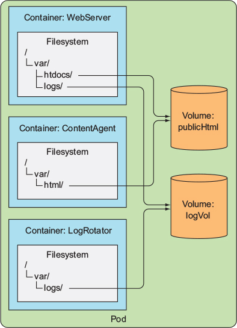

# volume
- pod 내 컨테이너들끼리 CPU, RAM, NIC 등은 공유하지만 디스크는 공유하지 못한다
    - 파일 시스템은 컨테이너 이미지에서 제공되기 때문이다
    - 이 같은 특징 때문에, 새로 시작한 컨테이너는 이전에 실행했던 컨테이너에 쓰여진 파일시스템의 어떤것도 볼 수 없다(같은 pod 내에서 실행되었더라도 마찬가지)
- 위와 같은 요구사항은 언제든 발생할 수 있는데, 쿠버네티스는 이를 volume 이라는 개념을 통해 해결한다

- 예를 들어 한 pod 에 아래와 같은 3개의 컨테이너가 들어있다고 가정해보자
    - /var/htdocs 에 있는 html 페이지를 서비스하고, /var/logs 에 로그를 쌓는 웹 서버 컨테이너
    - /var/html 에 주기적으로 html 파일을 생성해서 넣는 컨테이너
    - /var/logs 에 있는 로그를 처리하는 컨테이너
- 컨테이너 3개가 같이 동작해야하며, 같은 파일 시스템을 공유해야 한다
- 
    - publicHtml, logVol 이라는 volume 을 2개 만들고, 각 컨테이너에서 원하는 파일시스템의 경로에 volume 을 마운트했다
- 보다시피 volume 은 2가지 특성이 있다
    - 쿠버네티스 리소스가 아니므로 자체적으로 생성, 삭제될 수 없다
    - volume 을 생성만 한다고 되는것이 아니라, 각 컨테이너에서 직접 마운트 해줘야 한다

- volume 에도 여러 종류의 타입들이 있다
    - 위에서 사용한 volume 의 타입은 `emptyDir` 이다


## volume 을 사용한 컨테이너 간 데이터 공유
### emptyDir
- [fortuneloop.sh](fortuneloop.sh), [Dockerfile](Dockerfile), [fortune-pod.yaml](fortune-pod.yaml) 참조
- volume 이 빈 디렉터리로 시작된다
- 어떤 파일이든 volume 에 쓸 수 있다
- volume 의 라이프사이클이 pod 에 묶여 있으므로, pod 가 삭제되면 volume 의 컨텐츠도 삭제된다
- pod 를 호스팅하는 워커 노드의 실제 디스크에 생성된다 
    - 노드 디스크의 유형에 따라 성능이 결정된다
    - **여러 pod 간 volume 의 데이터를 공유할 수 없다**

### gitRepo
- [gitrepo-volume-pod.yaml](gitrepo-volume-pod.yaml) 참조
- 이름 그대로 git repository 에서 특정 리비전을 체크아웃해서 데이터를 채운다
- emptyDir volume 을 생성한 뒤 데이터를 채우는 것이다(emptyDir 의 확장)
- git 리포지터리와 동기화되지 않기 때문에, 변경사항이 발생하면 pod 를 재시작 해줘야만 한다
- 매번 변경이 발생할 때 마다 재시작 해줄수는 없으므로, git 동기화를 해주는 **사이드카 컨테이너**를 추가해줘야 한다
    - [gitrepo-with-gitsync-pod](gitrepo-with-gitsync-pod.yaml) 참조
    - <https://coffeewhale.com/kubernetes/git-sync/2020/02/22/git-sync/>


## 워커 노드 파일시스템의 파일 접근
- 대부분의 pod 는 자신의 호스트 노드에 있는 파일시스템에 접근하지 않지만, 특정 시스템 pod 들은 자신의 호스트 노드에 있는 파일시스템에 접근해야 한다
    - 로그를 수집해서 ELK 로 쏴주는 pod 라던가..

### hostPath
- 쿠버네티스의 hostPath volume 를 사용하면 이를 해결할 수 있다
    - 아래는 hostPath volume 을 설정했을 때의 모습이다
    - 
- 이 volume 은 pod 의 라이프사이클을 따르지 않는다(pod 가 삭제되도 계속 남아있음)
- pod 가 어떤 노드에 스케줄링 되느냐에 따라 파일의 내용이 달라지기 떄문에, 여러 pod 가 공유해야 하는 데이터를 저장하기에는 적절하지 않다

## 퍼시스턴트 스토리지
- pod 가 어떤 노드에 있든 동일한 데이터를 사용해야 한다면, 지금까지 언급한 volume 유형을 사용할 수 없다
- 이러한 데이터는 NAS 유형 volume 에 저장되어야 한다

### GCE 퍼시스턴트 디스크를 volume 으로 사용하기
- [mongodb-pod-gcepd.yaml](mongodb-pod-gcepd.yaml) 참조
    - gce 의 persistent disk 를 mongodb 데이터 저장경로로 설정한 예시이다
- pod 가 삭제되고 다시 실행되어도 persistent disk 의 데이터는 영향을 받지 않는다
    ```shell
    $ kubectl create -f mongodb-pod-gcepd.yaml
    pod/mongodb created

    $ kubectl exec -it mongodb mongo
    ...
    > db.foo.insert({name:'foo'})
    WriteResult({ "nInserted" : 1 })    
    > db.foo.find()
    { "_id" : ObjectId("5f0aa154c0a7bdd97ac77e86"), "name" : "foo" }

    # pod 삭제
    $ kubectl delete po mongodb
    pod "mongodb" deleted

    # pod 다시 생성
    $ kubectl create -f mongodb-pod-gcepd.yaml
    pod/mongodb created

    $ kubectl exec -it mongodb mongo
    ...
    # 데이터가 그대로 유지됨
    > db.foo.find()
    { "_id" : ObjectId("5f0aa154c0a7bdd97ac77e86"), "name" : "foo" }
    ```

## 기반 스토리지 기술과 파드 분리
- 이상적으로 쿠버네티스에 애플리케이션을 배포하는 개발자는 기저에 어떤 유형의 스토리지 기술이 사용되는지, 어떤 유형의 물리 서버가 사용되는지 알 필요가 없어야 한다
    - 결국 위처럼 pod 정의에 GCE persistent disk 속성이 들어가는 것이 좋은 방향이 아니다
    - pod 정의를 GCE 말고 다른곳에서 사용할 수 없게 된다