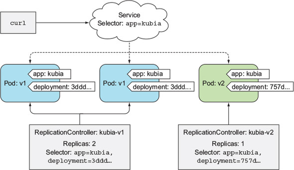
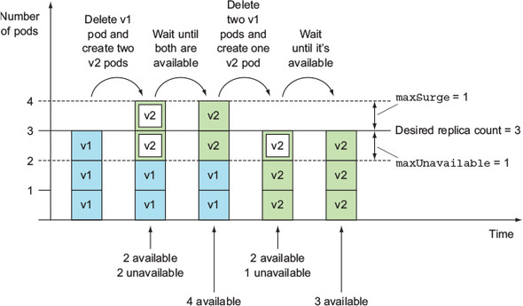

# rc로 수동 업데이트 수행
Service, ReplicaSet, Pod 로 구성된 어플리케이션을 새로운 버전으로 업데이트해야 할 때, 기본적으로 아래 2가지 방법을 쓸 수 있다  
- 기존 파드를 모두 삭제한 다음 새 파드를 시작한다
- 새로운 파드를 시작하고, 기동하면 기존 파드를 삭제한다

이 두 방법 모두 rc의 pod template 를 바꿔주면서 사용할 수 있다  
1. 먼저 [kubia-rc-and-service-v1.yaml](kubia-rc-and-service-v1.yaml) 를 통해 `kubia-v1` rc를 생성한다
  ```sh
  $ kubectl create -f kubia-rc-and-service-v1.yaml
  replicationcontroller/kubia-v1 created
  service/kubia created

  $ kubectl get po
  NAME             READY   STATUS    RESTARTS   AGE
  kubia-v1-lwrvp   1/1     Running   0          4s
  kubia-v1-vftcv   1/1     Running   0          4s
  kubia-v1-xrhth   1/1     Running   0          4s

  $ while true; do sleep 1; curl http://34.64.140.187; done
  This is v1 running in pod kubia-v1-lwrvp
  This is v1 running in pod kubia-v1-vftcv
  This is v1 running in pod kubia-v1-xrhth
  This is v1 running in pod kubia-v1-lwrvp
  ```
2. `kubectl edit` 으로 pod template 에서 사용하는 이미지의 버전을 변경한다
  ```sh
  $ kubectl edit rc kubia-v1
  ㅡㅡㅡㅡㅡㅡㅡㅡㅡㅡㅡㅡㅡㅡㅡㅡㅡㅡㅡㅡㅡㅡㅡㅡㅡㅡㅡㅡㅡㅡㅡㅡㅡㅡㅡㅡㅡㅡㅡㅡㅡㅡㅡㅡㅡㅡㅡㅡㅡㅡㅡㅡㅡㅡㅡ
  apiVersion: v1
  kind: ReplicationController
  metadata:
    # ...
  spec:
    replicas: 3
    selector:
      app: kubia
    template:
      metadata:
        creationTimestamp: null
        labels:
          app: kubia
        name: kubia
      spec:
        containers:
        - image: luksa/kubia:v1 # 이 부분 luksa/kubia:v2 로 변경하고 저장
          imagePullPolicy: IfNotPresent
        # ...
  status:
    # ...
  ㅡㅡㅡㅡㅡㅡㅡㅡㅡㅡㅡㅡㅡㅡㅡㅡㅡㅡㅡㅡㅡㅡㅡㅡㅡㅡㅡㅡㅡㅡㅡㅡㅡㅡㅡㅡㅡㅡㅡㅡㅡㅡㅡㅡㅡㅡㅡㅡㅡㅡㅡㅡㅡㅡㅡ

  replicationcontroller/kubia-v1 edited  
  ```
3. 기존 pod 삭제
  - 한번에 삭제(중단)해도 되고, 하나씩 삭제(무중단, 롤링)해도 된다
  - 한번에 삭제할 경우 서비스에 잠시 중단이 발생하고, 하나씩 삭제할 경우 2가지 버전이 서비스에 공존하는 시간이 발생한다
  ```sh
  $ kubectl delete -l app=kubia
  pod "kubia-v1-lwrvp" deleted
  pod "kubia-v1-vftcv" deleted
  pod "kubia-v1-xrhth" deleted

  $ kubectl get po
  NAME             READY   STATUS        RESTARTS   AGE
  kubia-v1-5fggm   1/1     Running       0          8s
  kubia-v1-hp7h5   1/1     Running       0          8s
  kubia-v1-lwrvp   1/1     Terminating   0          2m8s
  kubia-v1-rwflr   1/1     Running       0          8s
  kubia-v1-vftcv   1/1     Terminating   0          2m8s
  kubia-v1-xrhth   1/1     Terminating   0          2m8s

  $ while true; do sleep 1; curl http://34.64.140.187; done
  This is v2 running in pod kubia-v1-5fggm
  This is v2 running in pod kubia-v1-rwflr
  This is v2 running in pod kubia-v1-hp7h5
  This is v2 running in pod kubia-v1-hp7h5
  ```

위와 같이 어플리케이션 버전을 변경할 수 있지만, 수동으로 해줘야 하는 부분이 많아서 운영에서 쓰기에는 불편해보인다

# rc로 자동 업데이트 수행
kubectl 의 `rolling-update` 명렁어를 사용하면 더 간편하게 rolling update 를 수행할 수 있다  
```sh
$ kubectl rolling-update kubia-v1 kubia-v2 --image=luksa/kubia:v2
Command "rolling-update" is deprecated, use "rollout" instead
Created kubia-v2
Scaling up kubia-v2 from 0 to 3, scaling down kubia-v1 from 3 to 0 (keep 3 pods available, don't exceed 4 pods)
Scaling kubia-v2 up to 1
Scaling kubia-v1 down to 2
Scaling kubia-v2 up to 2
```
kubia-v2 라는 rc를 하나 더 띄우고, kubia-v2 replica 개수를 점진적으로 늘리고 kubia-v1 replica 개수를 점진적으로 낮추는 것 처럼 보인다  

```sh
$ kubectl get po
NAME             READY   STATUS        RESTARTS   AGE
kubia-v1-cm8d9   1/1     Terminating   0          2m29s
kubia-v1-nf24t   1/1     Running       0          2m29s
kubia-v1-whqm5   1/1     Running       0          2m29s
kubia-v2-lcvdp   1/1     Running       0          11s
kubia-v2-zl98h   1/1     Running       0          78s

$ kubectl get rc
NAME       DESIRED   CURRENT   READY   AGE
kubia-v1   3         3         3       21m
kubia-v2   1         1         1       7s
```
kubia-v2 replica 가 2개로 올라가고, kubia-v1 replica 가 2개로 내려가서 각 버전별로 pod 가 2개 떠있는 상태이며,  
rc가 2개 존재하는 것도 볼 수 있다  
아직 진행중이다  

```sh
...
Scaling kubia-v1 down to 1
Scaling kubia-v2 up to 3
Scaling kubia-v1 down to 0
Update succeeded. Deleting kubia-v1
replicationcontroller/kubia-v2 rolling updated to "kubia-v2"

$ kubectl get po
NAME             READY   STATUS        RESTARTS   AGE
kubia-v2-lcvdp   1/1     Running       0          2m35s
kubia-v2-r9qhm   1/1     Running       0          88s
kubia-v2-zl98h   1/1     Running       0          3m42s

$ kubectl get rc
NAME       DESIRED   CURRENT   READY   AGE
kubia-v2   3         3         3       4m1s
```
완료된 모습이다  
kubia-v1 rc 는 삭제되었음을 볼 수 있다  

보다시피 이 방식은 새로운 버전의 rc 를 띄운 뒤  
새로운 버전 rc 의 replica 는 점진적으로 올리고, 이전 버전 rc 의 replica 는 점진적으로 낮춰서 결국 0으로 만들어서 어플리케이션을 교체하는 전략이다  
(최종적으로는 기존 rc 또한 삭제하였음)  

근데 새로 생성된 rc 나 기존 rc 나 둘 다 labelSelector 로 app=kubia 을 사용할텐데, 어떻게 이 프로세스가 분리되어서 동작할 수 있었을까?  
현재 배포된 pod 의 label 을 살펴보면, 이유를 알 수 있다  
```sh
$ kubectl get po --show-labels
NAME             READY   STATUS    RESTARTS   AGE     LABELS
kubia-v2-lcvdp   1/1     Running   0          5m4s    app=kubia,deployment=32420f1af8ceda00fc6329e6ba90ec93
kubia-v2-r9qhm   1/1     Running   0          3m57s   app=kubia,deployment=32420f1af8ceda00fc6329e6ba90ec93
kubia-v2-zl98h   1/1     Running   0          6m11s   app=kubia,deployment=32420f1af8ceda00fc6329e6ba90ec93
```

kubectl 은 rolling-update 시 아래와 같이 동작한다  

1. 기존 pod 에 `deployment` label 을 추가한다
  ```sh
  $ kubectl get po --show-labels
  NAME             READY   STATUS    RESTARTS   AGE     LABELS
  # 기존 pod 들
  kubia-v1-fzvl6   1/1     Running   0          3m22s   app=kubia,deployment=3cf3a13bbecde562a87a0d6ad91ece04
  kubia-v1-mc7rr   1/1     Running   0          4m31s   app=kubia,deployment=3cf3a13bbecde562a87a0d6ad91ece04
  kubia-v1-q5ff5   1/1     Running   0          2m16s   app=kubia,deployment=3cf3a13bbecde562a87a0d6ad91ece04
  # 새로운 pod
  kubia-v2-lcvdp   1/1     Running   0          5m4s    app=kubia,deployment=32420f1af8ceda00fc6329e6ba90ec93
  ```
2. 기존 rc 의 label selector 에도 1번의 deployment label 을 추가한다
  ```sh
  $ kubectl get rc kubia-v1 -o yaml
  ...
  selector:
    app: kubia
    deployment: 3cf3a13bbecde562a87a0d6ad91ece04
  ```
  - deployment label 이 추가됨으로써 v1 pod 만 그룹핑 하게 된다
3. 새로운 rc 를 추가한다
  ```sh
  $ kubectl get rc kubia-v2 -o yaml
  selector:
    app: kubia
    deployment: 32420f1af8ceda00fc6329e6ba90ec93
  template:
    metadata:
      labels:
        app: kubia
        deployment: 32420f1af8ceda00fc6329e6ba90ec93
  ```
  - label selector 와 pod template 에 deployment label 이 추가되어 있다
4. 이를 기반으로 rolling update 를 진행한다

deployment label 을 각각 추가해줌으로써 rc 간에 pod select 가 겹치지 않았고, 그래서 rc 2개로 rolling-update 가 가능했던 것이다  

이 방법은 전자보단 괜찮은데, 아래와 같은 단점을 가지고 있다
- kubectl 이 label selector 를 임의로 바꿔버린다
  - 사이드 이펙트가 있을 수 있다
- rolling-update 를 수행해주는 주체가 컨트롤 플레인이 아니고 kubectl 이다
  - rolling-update 하는 동안 클라이언트 세션을 계속해서 유지해줘야 한다
  - 선언적으로 업데이트를 달성하는 쿠버네티스의 메인 철학에 맞지 않는다

# Deployment
위와 같은 단점때문에 Deployment 라는 새로운 오브젝트가 나오게 되었다  
배포시에 위의 rolling-update 처럼 직접 마스터 플레인에 명령을 수행하지 않고, Deployment 의 상태를 변경함으로써 선언적으로 배포를 달성할 수 있다  
Deployment 는 자신이 직접 배포를 수행하지 않고 rs 를 통해 배포를 수행하는 high-level 오브젝트라는 특징이 있다  

[kubia-deployment-v1.yaml](kubia-deployment-v1.yaml) 파일을 통해 Deployment 를 생성할 수 있다  
```sh
$ kubectl create -f kubia-deployment-v1.yaml --record # 이 옵션은 나중에 설명
deployment.apps/kubia created

$ kubectl get rs
NAME               DESIRED   CURRENT   READY   AGE
kubia-5dfcbbfcff   3         3         3       42s

$ kubectl get po
NAME                     READY   STATUS    RESTARTS   AGE
kubia-5dfcbbfcff-l6gz7   1/1     Running   0          47s
kubia-5dfcbbfcff-ljz7x   1/1     Running   0          47s
kubia-5dfcbbfcff-zxrb2   1/1     Running   0          47s
```
보다시피 자신이 직접 pod 배포를 수행하지 않고, rs 를 통해 pod 배포를 수행했음을 볼 수 있다(pod name 에 rs 해시값이 들어가있음)  

### Deployment 업데이트
Deployment 는 쿠버네티스에서 제공하는 오브젝트이기 때문에, 선언적 업데이트가 가능하다  
Deployment 에서 사용하고 있는 image 를 변경해보겠다  
```sh
$ kubectl set image deploy kubia nodejs=luksa/kubia:v2
deployment "kubia" image updated

$ kubectl get po
NAME                     READY   STATUS        RESTARTS   AGE
kubia-5dfcbbfcff-l6gz7   1/1     Terminating   0          8m51s
kubia-5dfcbbfcff-ljz7x   1/1     Terminating   0          8m51s
kubia-5dfcbbfcff-zxrb2   1/1     Terminating   0          8m51s
kubia-7c699f58dd-75cqn   1/1     Running       0          22s
kubia-7c699f58dd-gjhv4   1/1     Running       0          23s
kubia-7c699f58dd-wdfps   1/1     Running       0          19s

$ kubectl get rs
NAME               DESIRED   CURRENT   READY   AGE
kubia-5dfcbbfcff   0         0         0       8m53s
kubia-7c699f58dd   3         3         3       25s
```

상태를 변경했더니, 그에 맞춰 업데이트(배포)가 실행되었다  
rolling-update 처럼 kubectl 을 통해 직접 명령을 수행한 것이 아닌, 마스터 플레인이 업데이트를 수행했다는 점이 큰 차이점이다  
참고로 Deployment 의 상태를 변경하려면 아래의 명령어들을 사용해야 한다  
- kubectl edit : manifest 직접 수정
- kubectl patch : 오브젝트 개별 속성 수정
- kubectl apply : yaml/json 파일의 속성 값을 적용(없으면 생성)
- kubectl replace : yaml/json 파일로 속성 값을 대체(없으면 에러)
- kubectl set image : 컨테이너 이미지 변경

> ConfigMap 을 수정하여도 Deployment 가 재시작 되지 않으니 주의해야 한다  
> 설정만 수정해서 재배포 하고 싶다면 새로운 ConfigMap 을 만들어 참조하도록 해야한다  

업데이트가 실제 사용시에 가장 많이 쓰이게 될 기능일 것이고, 배포 파이프라인에서는 아래와 같은 기능을 추가해야 할 것이다
- 전달받은 image tag 를 통해 Deployment 의 image 교체
  - tag 값은 CI/CD 툴으로부터 전달받을 것이므로 deployment spec 파일의 image 에 굳이 tag 를 명시할 필요는 없다
- manifest 내용 변경 시 ConfigMap 교채

### Deployment 롤백
배포 후 rs 를 조회해보니, 기존의 rolling-update 와 다르게 이전 rs 가 삭제되지 않고 남아있음을 볼 수 있다  
```sh
$ kubectl get rs
NAME               DESIRED   CURRENT   READY   AGE
kubia-5dfcbbfcff   0         0         0       19m
kubia-7c699f58dd   3         3         3       11m
```

이를 남겨놓은 이유는, rollout(rolling-update)을 rollaback 할 떄 사용하기 위함이다  
```sh
$ kubectl rollout history deploy kubia
deployment.extensions/kubia
REVISION  CHANGE-CAUSE
# 왜 이렇게만 뜨는지 모르겠다
1         kubectl apply --filename=kubia-deployment-v1.yaml --record=true
2         kubectl apply --filename=kubia-deployment-v1.yaml --record=true
```

특정 revision 으로 롤백하려면 아래의 명령어를 사용하면 된다   
```sh
$ kubectl rollout undo deploy kubia --to-revision=1
deployment.extensions/kubia rolled back

$ kubectl get po
NAME                     READY   STATUS              RESTARTS   AGE
kubia-5dfcbbfcff-lkvsr   1/1     Running             0          2s
kubia-5dfcbbfcff-vzzk7   0/1     ContainerCreating   0          0s
kubia-5dfcbbfcff-zbqq5   1/1     Running             0          4s
kubia-7c699f58dd-gbhkv   1/1     Terminating         0          37s
kubia-7c699f58dd-nvllj   1/1     Terminating         0          41s
kubia-7c699f58dd-v995v   1/1     Terminating         0          40s
```
새로 뜬 pod 들이 종료되고 revision 1 의 pod 들이 다시 뜨는 모습이다  
Deployment 는 이와 같이 rollout history 를 가지고 있는것이 특징이다  
history 수는 `editHistoryLimit` 속성에 의해 결정되며, default 값은 2로 설정되어 있다(현재와 이전 버전만 기록)  

### maxSurge, maxUnavaliable 속성
Deployment 에 아래의 속성을 추가할 수 있다  
```yaml
spec:
  strategy:
    rollingUpdate:
      maxSurge: 1
      maxUnavaliable: 0
    type: RollingUpdate
```
> 참고로 여기서 Deployment 의 type 을 RollingUpdate 로 줬는데, 원래 이게 default 값이다  
> RollingUpdate 외에 Recreate 도 있는데, 이는 처음에 언급했던 중단 배포 방식(다 지우고 새로 배포)이다  

maxSurge
- Deployment 가 의도하는 replica 수보다 얼마나 많은 pod 수를 허용할 수 있는지 결정한다
- 기본값은 25%이다(백분율을 숫자로 반환하면 값이 반올림 됨)
- 숫자로 지정 가능

maxUnavaliable
- Deployment 가 의도하는 replica 수를 기준으로 사용할 수 없는 pod 수를 결정한다
- 기본값은 25%이다(백분율을 숫자로 반환하면 값이 내림 됨)
- 숫자로 지정 가능

말로만 봐서는 이해가 가지 않는데, 위의 maxSurge/maxUnavaliable 속성을 통해 rollout 이 어떻게 진행되는지 보자  

1. Deployment 에 지정한 replica 가 3개였으니 maxSurge 를 숫자로 반환하면 4이고, maxUnavaliable 을 숫자로 반환하면 2가 된다
2. v1 pod 를 하나 삭제하고 v2 pod 를 2개 추가로 생성한다
  - available 한 pod 는 2개이며, maxUnavaliable 을 넘지 않았음
3. v2 pod 2개 생성이 완료됨
  - available 한 pod 는 4개이며, maxSurge 를 넘지 않았음
4. v1 pod 2개 삭제
  - avaliable pod 2개, maxUnavaliable 넘지 않음
5. v2 pod 1개 생성

> maxSurge, maxUnavailable 은 Deployment 에 의도한 replica 수에 비례한다는 점을 명심해야 한다

### minReadySeconds 속성
이 속성은 새로 뜬 pod 를 사용 가능한 것으로 취급하기 전에 대기할 시간을 지정한다  
default 가 0 이라, rollout 시 pod 가 하나 뜨자마자 바로 다음 pod 를 실행한다  
pod 가 실제 트래픽을 받은 후 문제가 없을 때 다음 pod 를 실행하는것이 좋으므로, 보통은 minReadySeconds 속성을 훨씬 높게 설정한다  

[kubia-deployment-v3-with-readinesscheck](kubia-deployment-v3-with-readinesscheck.yaml) 는 minReadySeconds 와 readinessProbe 를 적용한 Deployment 인데, 이를 통해 Deployment 가 rollout 을 차단하는 과정을 볼 수 있다  
> kubia:v3 어플리케이션은 요청을 5번 이상 받으면 500 에러를 반환한다

```sh
$ kubectl apply -f kubia-deployment-v3-with-redinesscheck.yaml
deployment.apps/kubia configured

$ kubectl get po
NAME                     READY   STATUS    RESTARTS   AGE
kubia-6789549647-bfvnz   1/1     Running   0          92s
kubia-6789549647-fc52n   1/1     Running   0          104s
kubia-6789549647-mvrp8   1/1     Running   0          117s
kubia-84b59979b9-gwpph   1/1     Running   0          2s

$ kubectl get po
NAME                     READY   STATUS    RESTARTS   AGE
kubia-6789549647-bfvnz   1/1     Running   0          103s
kubia-6789549647-fc52n   1/1     Running   0          115s
kubia-6789549647-mvrp8   1/1     Running   0          2m8s
kubia-84b59979b9-gwpph   0/1     Running   0          13s

$ kubectl get po
NAME                     READY   STATUS    RESTARTS   AGE
kubia-6789549647-bfvnz   1/1     Running   0          2m10s
kubia-6789549647-fc52n   1/1     Running   0          2m22s
kubia-6789549647-mvrp8   1/1     Running   0          2m35s
kubia-84b59979b9-gwpph   0/1     Running   0          40s
```

보다시피 처음 pod 가 떳다가 status 가 바뀌고, 더 이상 배포가 진행되지 않고 있는데, 이는 아래의 이유 떄문이다
1. pod 가 처음 뜨고, 다음 pod 배포 전까지 minReadySeconds 인 10초를 대기한다
2. 그 사이에 readinessProbe 가 1초마다 실행되고, 5초가 넘어갔을 때 500 에러가 발생하면서 readinessProbe 가 실패한다
3. pod 가 엔드포인트에서 제거된다
4. 이후 배포가 진행되지 않는다

minReadySeconds 속성 때문에 잘못된 버전이 전체 배포되는 사태를 막을 수 있었으므로, 이 두 속성을 적절하게 꼭 정의해주는 것이 좋다  

참고로 아래는 배포하고 트래픽을 받았을 때의 모습인데, 초반에 트래픽을 받다가 readiness probe 실패 후 더 이상 트래픽을 받지 않는 모습을 볼 수 있다  
```sh
$ while true; do curl http://34.64.140.187; done
This is v2 running in pod kubia-7c699f58dd-ssxlp
This is v2 running in pod kubia-7c699f58dd-wmrcq
This is v3 running in pod kubia-84b59979b9-hvn45
This is v3 running in pod kubia-84b59979b9-hvn45
This is v2 running in pod kubia-7c699f58dd-wmrcq
This is v2 running in pod kubia-7c699f58dd-5s67l
This is v2 running in pod kubia-7c699f58dd-wmrcq
This is v2 running in pod kubia-7c699f58dd-5s67l
This is v2 running in pod kubia-7c699f58dd-ssxlp
This is v2 running in pod kubia-7c699f58dd-5s67l
This is v2 running in pod kubia-7c699f58dd-wmrcq
This is v2 running in pod kubia-7c699f58dd-wmrcq
```

# Deployment 를 이용한 blue/green 배포
매우 간단하게 설정 가능하다  
기존 서비스가 [bluegreen-blue.yaml](bluegreen-blue.yaml), [bluegreen-service.yaml](bluegreen-service.yaml) 로 구성되어 있다고 가정하자  
```sh
$ kubectl get po
NAME                           READY   STATUS    RESTARTS   AGE
kubia-blue-77599c9c8b-2qfnz    1/1     Running   0          103m
kubia-blue-77599c9c8b-nkzqj    1/1     Running   0          103m
kubia-blue-77599c9c8b-vdmpd    1/1     Running   0          103m

$ kubectl get svc
kubia        LoadBalancer   10.120.3.13   34.64.200.253   80:31958/TCP   103m
```

현재 이미지 버전이 v1 인데, 이를 v2 로 올려야 한다  
Deployment 를 사용한 blue/green 배포 절차는 다음과 같다
1. [bluegreen-green.yaml](bluegreen-green.yaml) 을 통해 v2 이미지를 가진 Deployment 를 생성한다
  ```sh
  $ kubectl create -f bluegreen-green.yaml
  deployment/kubia-green created

  $ kubectl get po
  NAME                           READY   STATUS    RESTARTS   AGE
  kubia-blue-77599c9c8b-2qfnz    1/1     Running   0          105m
  kubia-blue-77599c9c8b-nkzqj    1/1     Running   0          105m
  kubia-blue-77599c9c8b-vdmpd    1/1     Running   0          105m
  kubia-green-6b9bbb8f5d-c5fbg   1/1     Running   0          98s
  kubia-green-6b9bbb8f5d-d5hqg   1/1     Running   0          98s
  kubia-green-6b9bbb8f5d-p6t2f   1/1     Running   0          98s
  ```
2. svc 의 labelSelector 를 수정한다
  - 어떤 방식으로 하든 상관없는데, 여기서는 `kubectl edit` 으로 수정했다
  ```sh
  $ kubectl edit svc kubia
  ㅡㅡㅡㅡㅡㅡㅡㅡㅡㅡㅡㅡㅡㅡㅡㅡㅡㅡㅡㅡㅡㅡㅡㅡㅡㅡㅡㅡㅡㅡㅡㅡㅡㅡㅡㅡㅡㅡㅡㅡㅡㅡㅡㅡㅡㅡㅡㅡㅡㅡㅡㅡㅡㅡㅡ
  apiVersion: v1
  kind: Service
  metadata:
    # ...
  spec:
    # ...
    selector:
      app: kubia
      version: v1 # 이 부분 v2 로 변경
    # ...
  status:
    # ...
  ㅡㅡㅡㅡㅡㅡㅡㅡㅡㅡㅡㅡㅡㅡㅡㅡㅡㅡㅡㅡㅡㅡㅡㅡㅡㅡㅡㅡㅡㅡㅡㅡㅡㅡㅡㅡㅡㅡㅡㅡㅡㅡㅡㅡㅡㅡㅡㅡㅡㅡㅡㅡㅡㅡㅡ
  ```
3. 트래픽이 v1 에서 v2 로 바로 변경되었다
  ```sh
  $ while true; do sleep 1s; curl http://34.64.200.253; done
  This is v1 running in pod kubia-blue-77599c9c8b-nkzqj
  This is v1 running in pod kubia-blue-77599c9c8b-nkzqj
  This is v1 running in pod kubia-blue-77599c9c8b-vdmpd
  This is v1 running in pod kubia-blue-77599c9c8b-2qfnz
  This is v1 running in pod kubia-blue-77599c9c8b-nkzqj
  This is v1 running in pod kubia-blue-77599c9c8b-2qfnz
  This is v1 running in pod kubia-blue-77599c9c8b-vdmpd
  This is v1 running in pod kubia-blue-77599c9c8b-2qfnz
  This is v1 running in pod kubia-blue-77599c9c8b-2qfnz
  This is v1 running in pod kubia-blue-77599c9c8b-nkzqj
  This is v2 running in pod kubia-green-6b9bbb8f5d-c5fbg
  This is v2 running in pod kubia-green-6b9bbb8f5d-p6t2f
  This is v2 running in pod kubia-green-6b9bbb8f5d-d5hqg
  This is v2 running in pod kubia-green-6b9bbb8f5d-d5hqg
  This is v2 running in pod kubia-green-6b9bbb8f5d-c5fbg
  ```
4. 문제없으면 kubia-blue Deployment 를 삭제하고, 문제가 발생했다면 다시 svc 의 labelSelector 를 변경해서 롤백해주면 된다

하드웨어 리소스가 한동안 2배로 필요하다는 단점은 존재한다